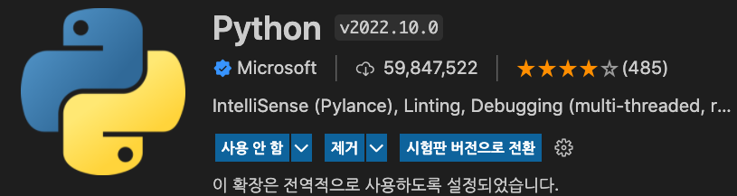
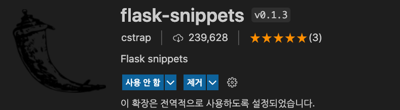
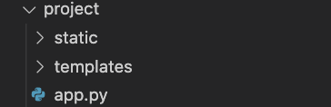
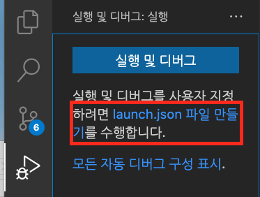
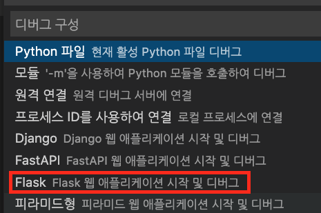
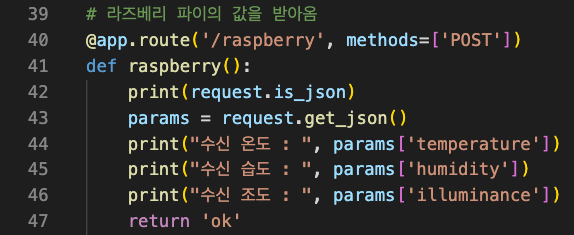

### Server 구동법

1. Vscode Extention 설치

 - Python, flask-snippets 2개의 Extention을 설치합니다.
    

2. 구조이해

 - Flask를 이용해 웹서버를 열고있습니다.
 - Flask에서는 static에 css,js 등의 파일을 담고, templates에 html 파일을 넣습니다.
 - 서버 구동을 위한 코드는 app.py에 있습니다.
    

3. 실행 설정

 - 왼쪽 디버그 버튼 선택
 - 실행 및 디버그 버튼이 아닌 launch.json파일 만들기를 선택합니다.
    

4. 디버그 구성

 - 사진에 표기된 것 처럼 Flask 선택
 - 여기까지 하면 환경 구성은 끝이다.
    

5. 데이터 수신

 - 해당 라우팅 주소에 어떤 형식(ex. Post, Get)으로 데이터를 수신할 지 명시되어 있다.
 - json형태로 받은 데이터를 그대로 출력하는 모습이다.
    

실행버튼

   
   
